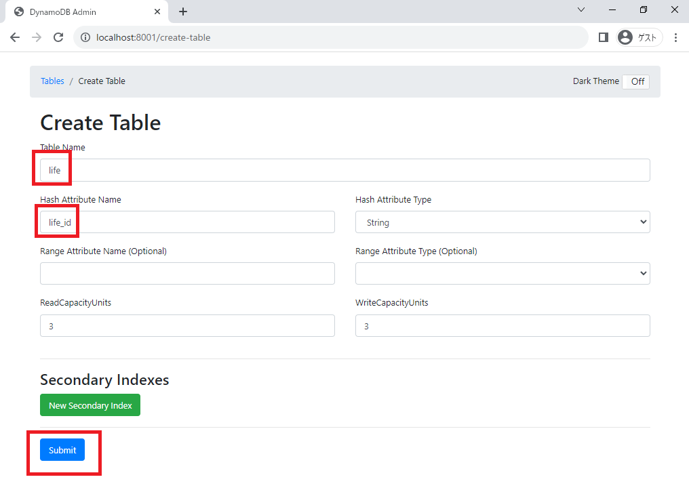

# lifeplanappの使い方

- `git clone https://github.com/ryomeblog/lifeplanapp.git`
- `cd lifeplanapp`
- `docker-compose up -d`
- http://localhost:8001 にアクセスする
- lifeテーブルを作成する
  - テーブル名：`life`
  - Hash Attribute Name：`life_id`
  - Hash Attribute Type：`String`

- http://localhost:13000 にアクセスする

